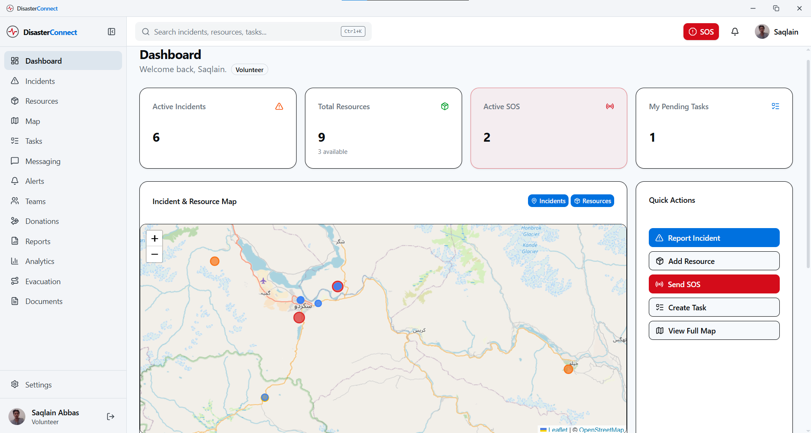
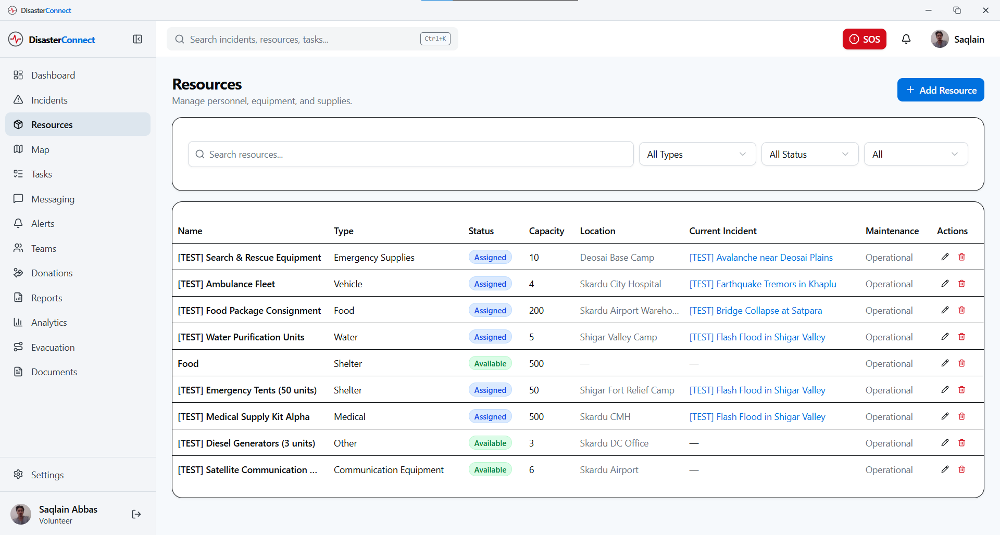
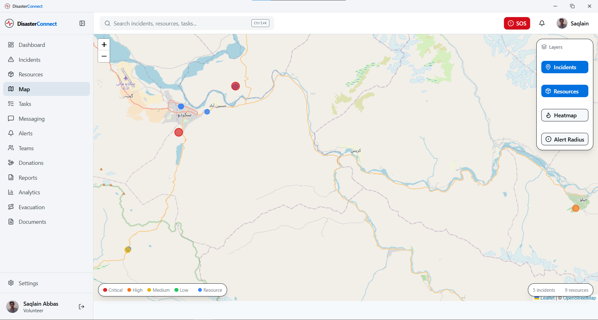
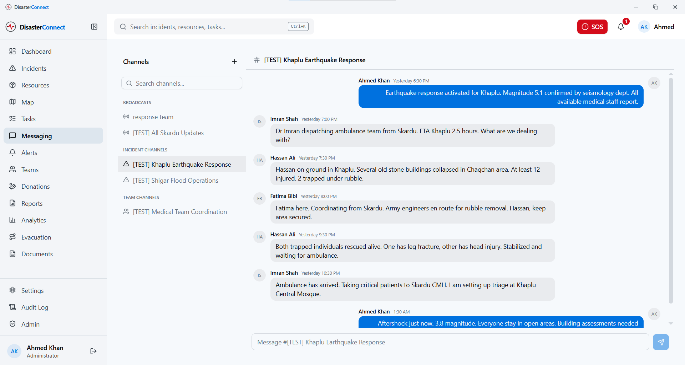
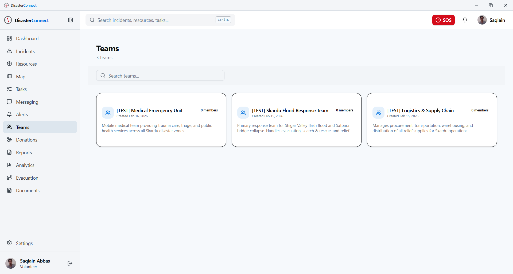
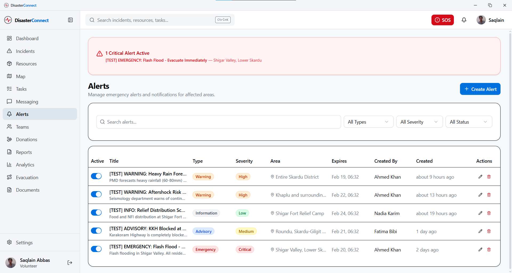
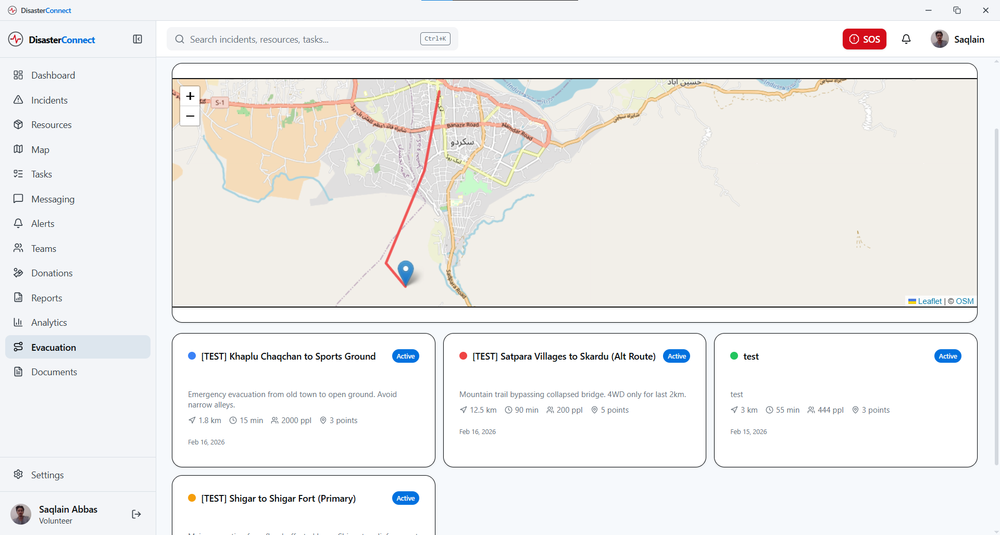
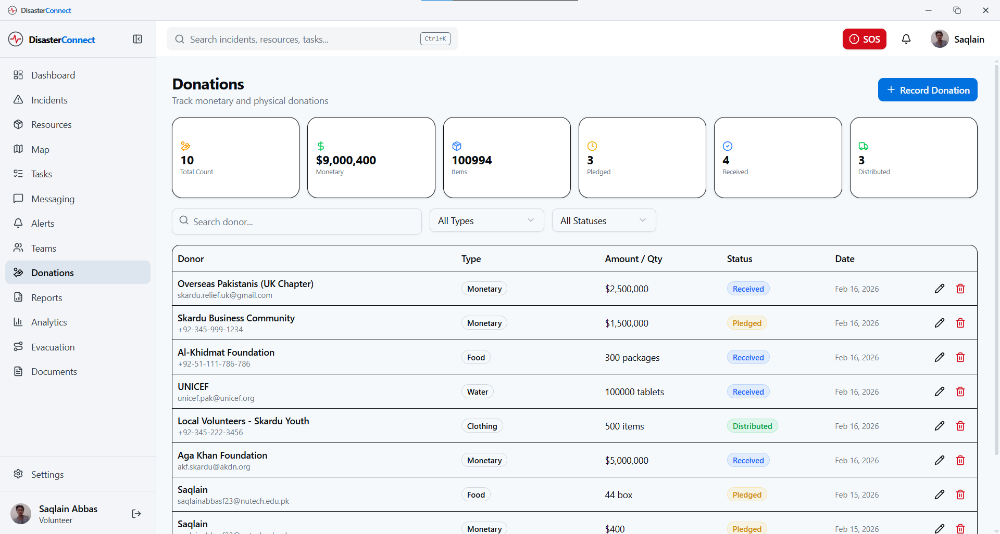
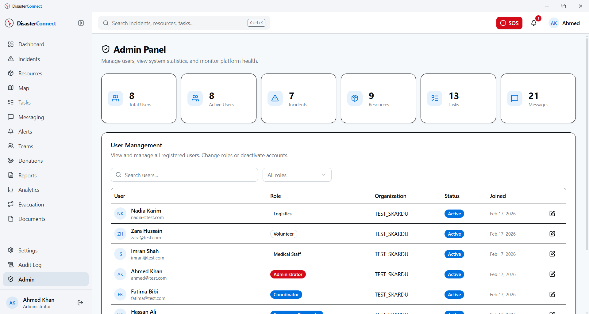

<div align="center">


# DisasterConnect

**Real-time disaster management and emergency response coordination**

Coordinate teams, track incidents, and manage resources — all from one desktop app.

[](https://github.com/Razee4315/DisasterConnect_APP/releases)
[](https://github.com/Razee4315/DisasterConnect_APP/actions)
[](LICENSE)

**Windows** · **Linux**

</div>

---

## Why DisasterConnect

When disaster strikes, coordination saves lives.

Emergency teams juggle radio calls, spreadsheets, WhatsApp groups, and paper maps. Critical information gets lost, resources are misallocated, and response times suffer.

DisasterConnect puts everything in one place — real-time incident tracking, resource management, team coordination, and emergency alerts — so responders can focus on what matters.

---

## Overview

DisasterConnect is a desktop application for disaster management teams to coordinate emergency response in real time. Built with Tauri for native performance and Supabase for real-time sync.



---

## Features

- **Dashboard** — Real-time overview with interactive map, stats, and recent activity
- **Incident Management** — Report, track, and manage disaster events with severity levels
- **Resource Coordination** — Manage personnel, equipment, vehicles, and supplies
- **Task Board** — Kanban-style task management with drag-and-drop
- **Team Messaging** — Real-time communication channels for coordination
- **Emergency Alerts** — Broadcast alerts with severity and affected area tracking
- **SOS System** — One-click emergency distress signal
- **Evacuation Routes** — Plan and share evacuation paths on interactive maps
- **Donations Tracking** — Manage monetary and material donations
- **Document Management** — Upload and organize incident-related files
- **Reports & Analytics** — Visual analytics on incidents, resources, and response
- **Admin Panel** — User management, roles, and audit logging
- **Offline Support** — Queue actions when offline, auto-sync when reconnected
- **Dark Mode** — Full dark theme optimized for command center environments
- **System Tray** — Runs in background with quick-access tray menu
- **Command Palette** — Spotlight-style search with `Ctrl+K`


---

## Installation

Download the latest release:

- **Windows**: `.exe`, `.msi`
- **Linux**: `.deb`, `.AppImage`

macOS support is planned.

---

## Usage

### Keyboard Shortcuts

| Action | Shortcut |
|--------|----------|
| Command Palette | `Ctrl + K` |
| Search | `Ctrl + /` |
| Settings | `Ctrl + ,` |
| SOS | `Ctrl + Shift + S` |
| New Incident | `Ctrl + N` |
| Toggle Sidebar | `Ctrl + B` |

### Quick Start

1. Download and install from [Releases](https://github.com/Razee4315/DisasterConnect_APP/releases)
2. Create an account or sign in
3. You land on the Dashboard with map overview and stats
4. Use the sidebar to navigate between modules

---

## Screenshots

| Dashboard | Incident Management |
|:-:|:-:|
|  |  |

| Resource Management | Map View |
|:-:|:-:|
|  |  |

| Task Board (Kanban) | Messaging |
|:-:|:-:|
|  |  |

| Teams | Alerts |
|:-:|:-:|
|  |  |

| Evacuation Routes | Donations |
|:-:|:-:|
|  |  |

| Reports | Analytics |
|:-:|:-:|
|  |  |

| Admin Panel | Settings |
|:-:|:-:|
|  |  |

---

## Tech Stack

| Layer | Technology |
|-------|-----------|
| Framework | [Tauri v2](https://tauri.app) |
| Frontend | React 19, TypeScript, Vite |
| Styling | Tailwind CSS v4, shadcn/ui |
| State | Zustand, TanStack Query |
| Backend | Supabase (Auth, Database, Realtime, Storage) |
| Maps | Leaflet + OpenStreetMap |
| Package Manager | Bun |

---

## Development

### Requirements

- Bun 1.0+
- Rust 1.70+
- Tauri v2 system dependencies

### Run Locally

```bash
git clone https://github.com/Razee4315/DisasterConnect_APP.git
cd DisasterConnect_APP
bun install
bun run tauri dev
```

### Build

```bash
bun run tauri build
```

---

## Contributing

Contributions are welcome. Please read the [Contributing Guide](CONTRIBUTING.md) before submitting a pull request.

All contributors are expected to follow the [Code of Conduct](CODE_OF_CONDUCT.md).

---

## Security

To report a vulnerability, please read the [Security Policy](SECURITY.md). Do not open a public issue for security concerns.

---

## License

This project uses a **Source Available** license. See [LICENSE](LICENSE) for details.

- Free for personal and educational use
- Free to modify for personal use
- Commercial use is not permitted without written permission
- Redistribution for profit is prohibited without a license

---

## Author

**Saqlain Abbas**

- GitHub: https://github.com/Razee4315
- LinkedIn: https://linkedin.com/in/saqlainrazee
